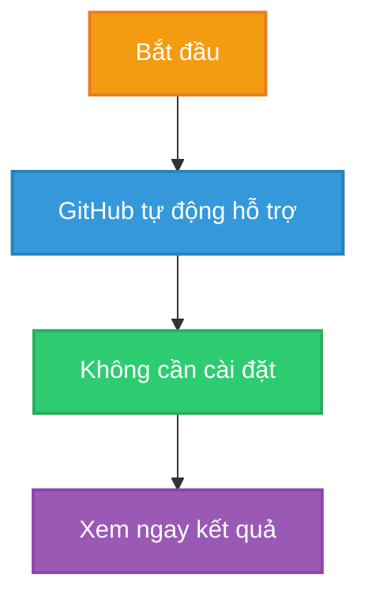

# hoc-mermaid-nk

```mermaid
graph TD
    A[Bắt đầu] --> B[GitHub tự động hỗ trợ]
    B --> C[Không cần cài đặt]
    C --> D[Xem ngay kết quả]

    style A fill:#f39c12,stroke:#e67e22,stroke-width:2px,color:#fff
    style B fill:#3498db,stroke:#2980b9,stroke-width:2px,color:#fff
    style C fill:#2ecc71,stroke:#27ae60,stroke-width:2px,color:#fff
    style D fill:#9b59b6,stroke:#8e44ad,stroke-width:2px,color:#fff

```
